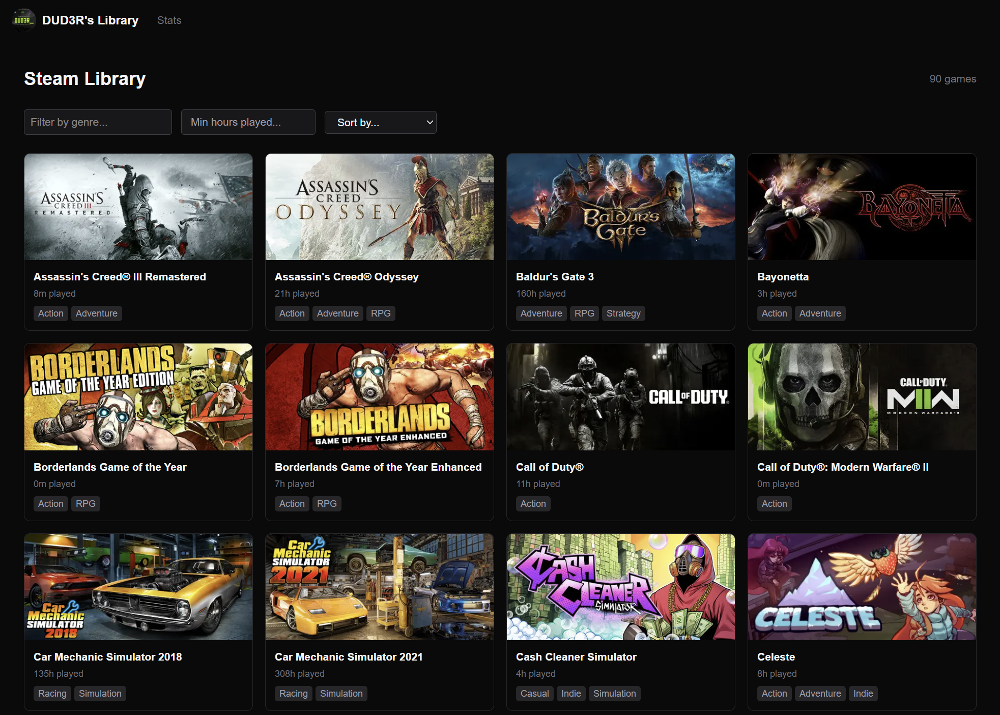
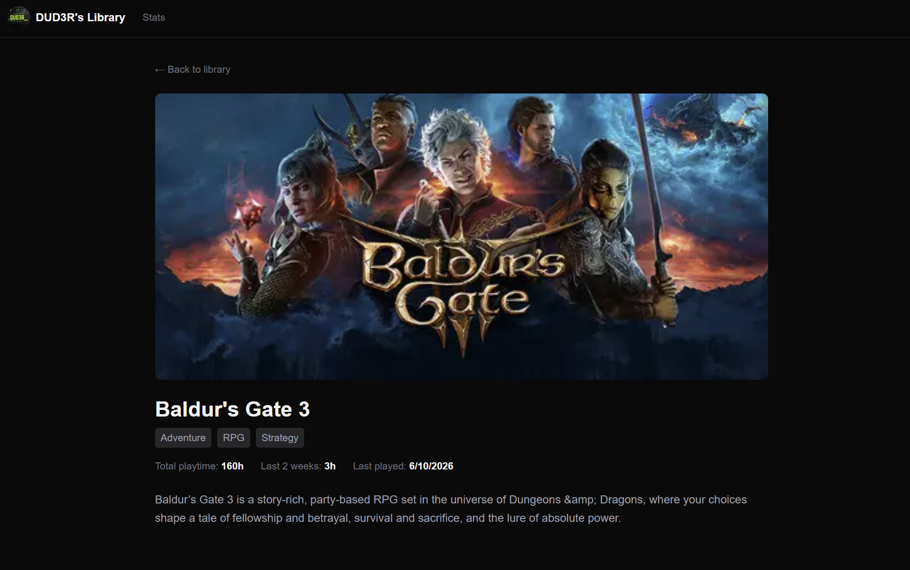
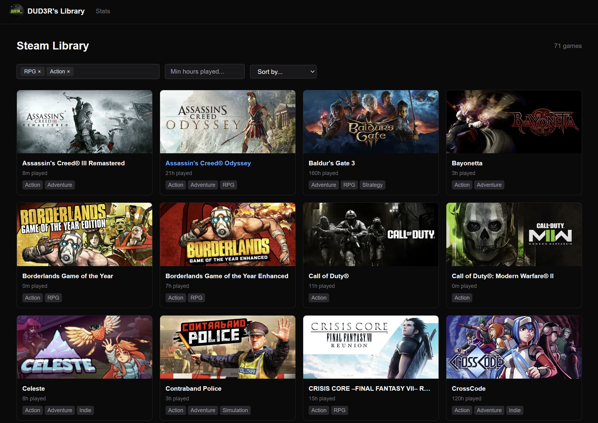
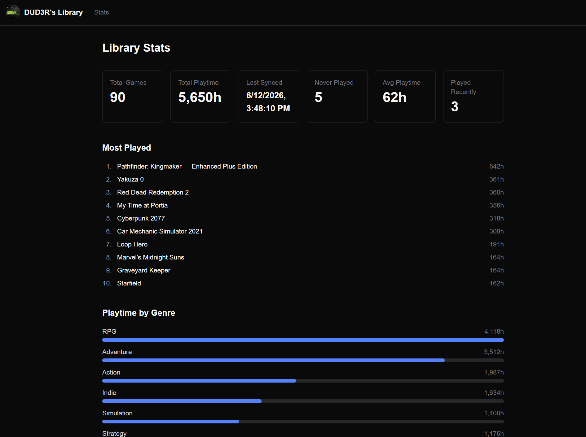
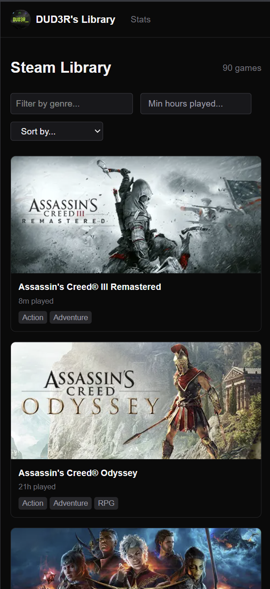

# Steam Storefront

A personal Steam library browser built as a portfolio project. Syncs your Steam game library into a local database and presents it as a polished storefront with filtering, sorting, game detail pages, and a stats dashboard.

Deployable with a single `docker compose up`.

---



<details>
<summary>More screenshots</summary>






</details>

---

## Features

- Browse your Steam library as a searchable, filterable storefront
- Filter by one or more genres simultaneously, sort by name, playtime, or last played
- Paginated game grid with fast server-side rendering on first load
- Game detail pages with descriptions, genres, and playtime stats
- Stats dashboard — total playtime, genre breakdowns, top games, recently played
- Automatic background sync from Steam every 30 minutes; manual sync available via API
- Two-layer caching (PostgreSQL + Redis) for consistent response times

## Tech Stack

| Layer | Choice |
|---|---|
| Backend | ASP.NET Core Web API (C#) |
| ORM | Entity Framework Core |
| Database | PostgreSQL |
| Cache | Redis |
| Frontend | Next.js + TypeScript |
| Styling | Tailwind CSS |
| Infra | Docker Compose |

## Getting Started

**Prerequisites:** Docker Desktop

1. Get your credentials:
   - **Steam API key:** [steamcommunity.com/dev/apikey](https://steamcommunity.com/dev/apikey)
   - **Steam ID (64-bit):** [steamidfinder.com](https://www.steamidfinder.com)

2. Create a `.env` file in the project root:
   ```
   STEAM_API_KEY=your_key_here
   STEAM_ID=your_64bit_steam_id
   POSTGRES_PASSWORD=choose_a_password
   ```

3. Start the stack:
   ```bash
   docker compose up --build
   ```

4. Open [http://localhost:3000](http://localhost:3000)

The app triggers an initial Steam sync on startup. Your library will appear within a minute or two depending on its size.

To stop:
```bash
docker compose down        # stop containers
docker compose down -v     # stop and wipe the database
```

## Architecture

The backend does not proxy the Steam API on demand — it syncs Steam data into PostgreSQL on a schedule and serves its own data layer. This decouples the frontend from Steam's rate limits and availability, enables rich SQL queries, and keeps response times consistent.

Stats are pre-computed after each sync and stored as a snapshot, making the stats endpoint O(1) regardless of library size.

The Next.js frontend uses SSR for the game grid (fast initial paint) and CSR for the stats dashboard (data-heavy, loading state acceptable).

See [ARCHITECTURE.md](ARCHITECTURE.md) for detailed decision records and tradeoffs.

## API

```
GET  /api/v1/library              # paginated, filterable game list
GET  /api/v1/library/{appId}      # single game detail
GET  /api/v1/stats                # latest stats snapshot
POST /api/v1/sync                 # trigger a manual sync
```

Filter parameters: `?genre=RPG&minPlaytime=10&sort=playtime&page=1&pageSize=50`
